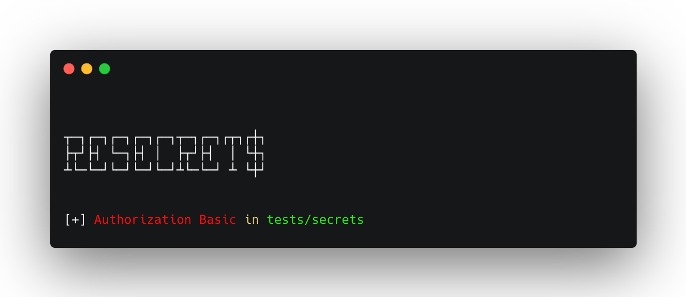

# 


###

Resecrets is a powerful tool designed for security researchers and developers to search for sensitive information such as credentials, tokens, and other secrets within directories. Using customizable regular expressions, Resecrets scans files to identify potential leaks and vulnerabilities, helping to enhance the security of your codebase.

### Features

•	Customizable regex patterns for targeted searches
•	Recursive scanning of directories
•	Easy integration into CI/CD pipelines
•	Supports multiple file types

### Usage

To use Resecrets, simply specify the directory. The tool will output any matches found, making it easy to locate and address potential security issues.

```sh
resecrets /path/to/scan
```

### Install

- via pipx:

```sh
pipx install git+https://github.com/phor3nsic/resecrets
```
- via pip:

```sh
pip install git+https://github.com/phor3nsic/resecrets
```

### License

This project is licensed under the MIT License.